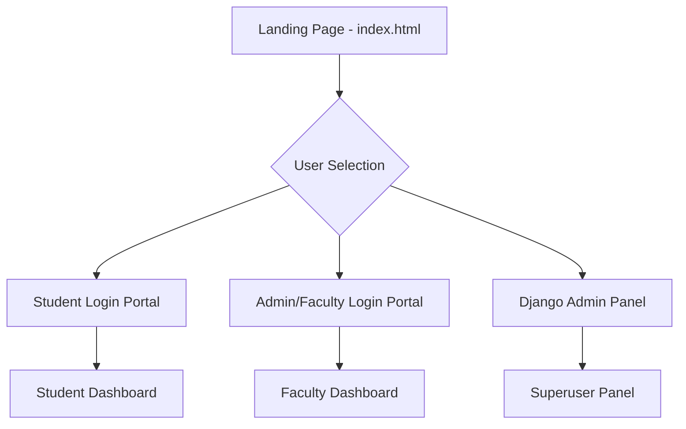
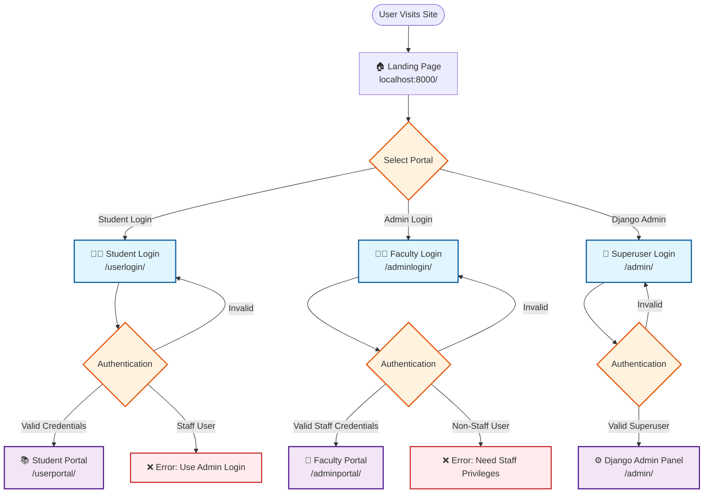
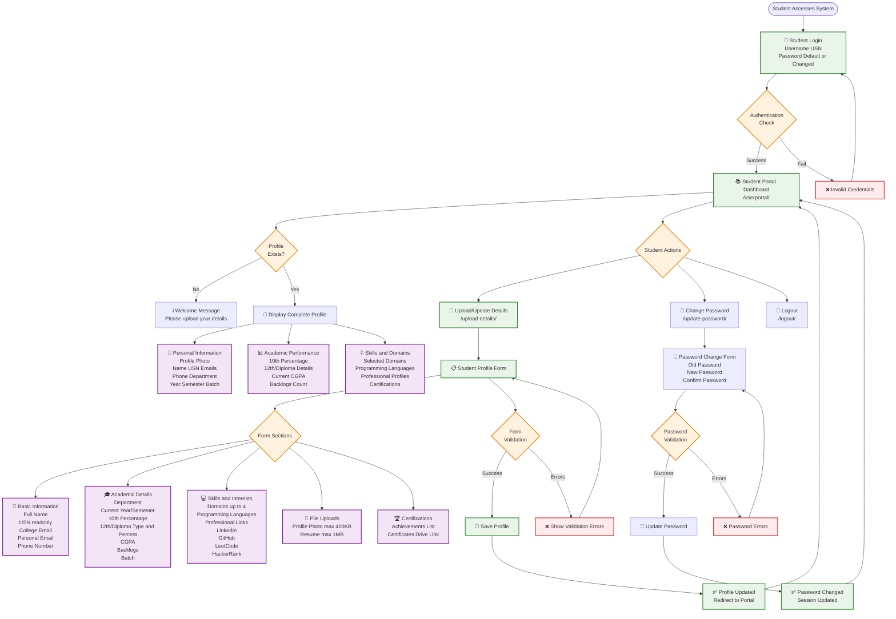
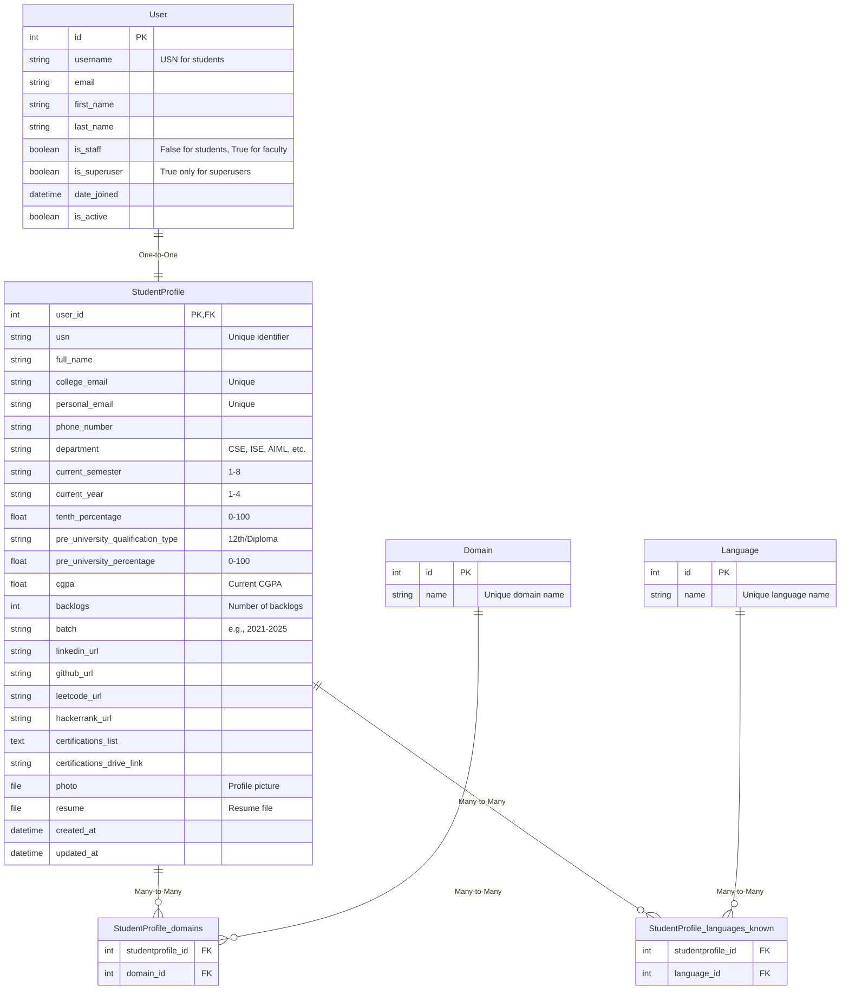
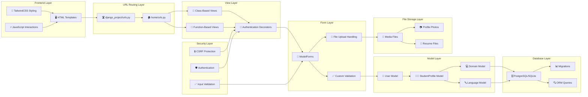
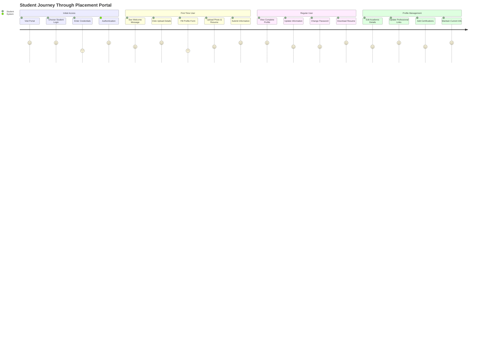
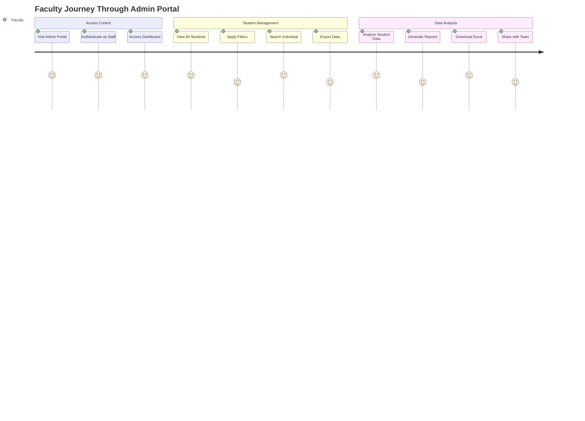
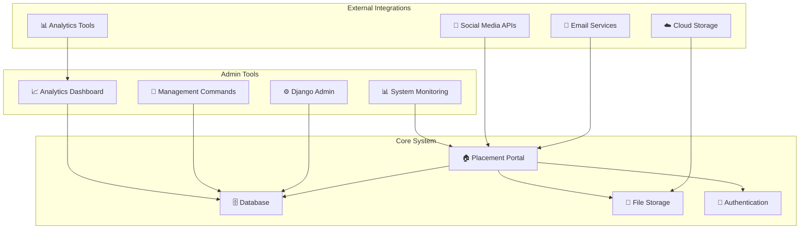

# 🏗️ **VVCE Placement Portal - Complete Architecture & Workflow**

## 🎯 **System Overview**

---

## 🔐 **Authentication Flow Architecture**

---

## 👨‍🎓 **STUDENT WORKFLOW - Complete Journey**

---

## 👨‍🏫 **FACULTY/ADMIN WORKFLOW - Management System**

```mermaid
graph TD
    Start([Faculty Accesses System]) --> Login[🔐 Faculty Login<br/>Username Faculty ID<br/>Password Assigned]
    
    Login --> Auth{Authentication<br/>and Staff Check}
    Auth -->|Success + is_staff=True| Portal[🏢 Faculty Portal Dashboard<br/>/adminportal/]
    Auth -->|Invalid Credentials| LoginError[❌ Invalid Credentials]
    Auth -->|Non-Staff User| StaffError[❌ No Staff Privileges]
    LoginError --> Login
    StaffError --> Login
    
    Portal --> MainFeatures{Faculty Dashboard<br/>Features}
    
    %% Main Features
    MainFeatures --> ViewStudents[👥 View All Students<br/>Complete Student List]
    MainFeatures --> FilterStudents[🔍 Advanced Filtering<br/>Multi-Criteria Search]
    MainFeatures --> SearchStudent[🔎 Search Individual<br/>By USN]
    MainFeatures --> ExportData[📊 Export Data<br/>Excel Download]
    MainFeatures --> ChangePassword[🔑 Change Password<br/>Faculty Account]
    MainFeatures --> Logout[🚪 Logout]
    
    %% View Students Detail
    ViewStudents --> StudentList[📋 Student List Display<br/>Profile Photos<br/>Basic Information<br/>Academic Details<br/>Contact Information<br/>Professional Links<br/>Certificates]
    
    %% Advanced Filtering System
    FilterStudents --> FilterOptions{Filter Categories}
    
    FilterOptions --> DeptFilter[🏛️ Department Filter<br/>CSE ISE AIML<br/>ECE EEE ME CE]
    FilterOptions --> YearFilter[📅 Academic Year<br/>1st 2nd 3rd 4th Year]
    FilterOptions --> CGPAFilter[📈 CGPA Filter<br/>Minimum CGPA threshold]
    FilterOptions --> BacklogFilter[📉 Backlogs Filter<br/>Maximum backlogs allowed]
    FilterOptions --> DomainFilter[💻 Domain Filter<br/>Software Development<br/>Data Science<br/>AI/ML etc]
    FilterOptions --> LanguageFilter[🔤 Language Filter<br/>Programming Languages]
    FilterOptions --> PercentageFilter[📊 Percentage Filters<br/>10th Percentage<br/>12th/Diploma Percentage]
    
    FilterOptions --> ApplyFilters[🎯 Apply Combined Filters]
    ApplyFilters --> FilteredResults[📊 Filtered Student List<br/>Real-time Results]
    FilteredResults --> ViewStudents
    
    %% Individual Search
    SearchStudent --> USNInput[📝 Enter USN<br/>Search Box]
    USNInput --> SearchValidate{USN<br/>Validation}
    SearchValidate -->|Found| StudentDetail[👤 Individual Student Profile<br/>Complete Details View]
    SearchValidate -->|Not Found| SearchError[❌ Student Not Found]
    SearchError --> USNInput
    
    StudentDetail --> DetailSections{Student Information<br/>Sections}
    DetailSections --> PersonalSection[👤 Personal Details<br/>Photo and Basic Info<br/>Contact Information]
    DetailSections --> AcademicSection[🎓 Academic Records<br/>Percentages and CGPA<br/>Department and Batch]
    DetailSections --> SkillSection[💡 Skills and Domains<br/>Selected Interests<br/>Programming Languages]
    DetailSections --> ProfessionalSection[🔗 Professional Links<br/>LinkedIn GitHub<br/>LeetCode HackerRank]
    DetailSections --> CertSection[🏆 Certifications<br/>Achievement List<br/>Certificate Links]
    DetailSections --> FileSection[📁 Uploaded Files<br/>Resume Download<br/>Profile Photo]
    
    %% Export Functionality
    ExportData --> ExportOptions{Export Options}
    ExportOptions --> ExportAll[📊 Export All Students<br/>Complete Database]
    ExportOptions --> ExportFiltered[🎯 Export Filtered Results<br/>Current Filter Applied]
    
    ExportAll --> GenerateExcel[📈 Generate Excel File]
    ExportFiltered --> GenerateExcel
    
    GenerateExcel --> ExcelFeatures{Excel Features}
    ExcelFeatures --> ExcelData[📋 Comprehensive Data<br/>All Student Fields<br/>Academic Performance<br/>Contact Information]
    ExcelFeatures --> ExcelLinks[🔗 Clickable Hyperlinks<br/>Professional Profiles<br/>Resume Downloads<br/>Certificate Links]
    ExcelFeatures --> ExcelFormatting[🎨 Professional Formatting<br/>Headers and Styling<br/>Auto-fit Columns]
    
    ExcelFeatures --> DownloadFile[⬇️ Download Excel File<br/>Timestamped Filename]
    
    %% Password Change
    ChangePassword --> FacultyPwdForm[🔑 Faculty Password Form<br/>Current Password<br/>New Password<br/>Confirm Password]
    FacultyPwdForm --> FacultyPwdValidate{Password<br/>Validation}
    FacultyPwdValidate -->|Success| FacultyPwdSave[💾 Update Password]
    FacultyPwdValidate -->|Errors| FacultyPwdError[❌ Password Errors]
    FacultyPwdError --> FacultyPwdForm
    FacultyPwdSave --> FacultyPwdSuccess[✅ Password Updated]
    FacultyPwdSuccess --> Portal
    
    %% Styling
    classDef process fill:#e8f5e8,stroke:#2e7d32,stroke-width:2px
    classDef decision fill:#fff3e0,stroke:#f57c00,stroke-width:2px
    classDef feature fill:#e3f2fd,stroke:#1976d2,stroke-width:2px
    classDef filter fill:#f1f8e9,stroke:#689f38,stroke-width:2px
    classDef data fill:#f3e5f5,stroke:#7b1fa2,stroke-width:2px
    classDef error fill:#ffebee,stroke:#d32f2f,stroke-width:2px
    classDef export fill:#fff8e1,stroke:#f9a825,stroke-width:2px
    
    class Login,Portal,StudentList,StudentDetail process
    class Auth,MainFeatures,FilterOptions,SearchValidate,DetailSections,ExportOptions,ExcelFeatures decision
    class ViewStudents,FilterStudents,SearchStudent,ExportData,ChangePassword feature
    class DeptFilter,YearFilter,CGPAFilter,BacklogFilter,DomainFilter,LanguageFilter,PercentageFilter filter
    class PersonalSection,AcademicSection,SkillSection,ProfessionalSection,CertSection,FileSection data
    class LoginError,StaffError,SearchError,FacultyPwdError error
    class GenerateExcel,ExcelData,ExcelLinks,ExcelFormatting,DownloadFile export
```

---

## 🔧 **SUPERUSER/DJANGO ADMIN WORKFLOW - System Management**

```mermaid
graph TD
    Start([Superuser Access]) --> AdminLogin[🔧 Django Admin Login<br/>/admin/<br/>Superuser Credentials]
    
    AdminLogin --> AdminAuth{Superuser<br/>Authentication}
    AdminAuth -->|Success| AdminPanel[⚙️ Django Admin Dashboard<br/>System Management]
    AdminAuth -->|Invalid| AdminLoginError[❌ Invalid Superuser Credentials]
    AdminLoginError --> AdminLogin
    
    AdminPanel --> AdminFeatures{Admin Panel<br/>Features}
    
    %% Core Admin Features
    AdminFeatures --> UserManagement[👥 User Management<br/>/admin/auth/user/]
    AdminFeatures --> StudentProfiles[👨‍🎓 Student Profiles<br/>/admin/home/studentprofile/]
    AdminFeatures --> DomainManagement[💻 Domain Management<br/>/admin/home/domain/]
    AdminFeatures --> LanguageManagement[🔤 Language Management<br/>/admin/home/language/]
    AdminFeatures --> SystemSettings[⚙️ System Settings]
    AdminFeatures --> DatabaseOperations[🗄️ Database Operations]
    
    %% User Management Details
    UserManagement --> UserActions{User Actions}
    UserActions --> CreateUsers[➕ Create New Users<br/>Students<br/>Faculty<br/>Superusers]
    UserActions --> ModifyUsers[✏️ Modify Existing Users<br/>Change Passwords<br/>Update Permissions<br/>Activate/Deactivate]
    UserActions --> DeleteUsers[🗑️ Delete Users<br/>Remove Access<br/>Archive Accounts]
    UserActions --> BulkOperations[📊 Bulk Operations<br/>Mass User Creation<br/>Bulk Permission Changes]
    
    %% Student Profile Management
    StudentProfiles --> ProfileActions{Profile Management}
    ProfileActions --> ViewAllProfiles[👀 View All Profiles<br/>Complete Student Data<br/>Advanced Filtering<br/>Search Capabilities]
    ProfileActions --> EditProfiles[✏️ Edit Student Profiles<br/>Update Information<br/>Correct Data<br/>Manage Files]
    ProfileActions --> BulkProfileOps[📊 Bulk Profile Operations<br/>Mass Updates<br/>Data Export<br/>Profile Analysis]
    ProfileActions --> ProfileValidation[✅ Data Validation<br/>Check Completeness<br/>Verify Information<br/>Quality Control]
    
    %% Domain Management
    DomainManagement --> DomainActions{Domain Actions}
    DomainActions --> AddDomains[➕ Add New Domains<br/>Emerging Technologies<br/>Industry Demands]
    DomainActions --> EditDomains[✏️ Edit Existing Domains<br/>Update Names<br/>Modify Descriptions]
    DomainActions --> RemoveDomains[🗑️ Remove Obsolete Domains<br/>Archive Old Domains<br/>Clean Database]
    DomainActions --> DomainAnalytics[📊 Domain Analytics<br/>Student Preferences<br/>Popular Domains<br/>Trend Analysis]
    
    %% Language Management
    LanguageManagement --> LanguageActions{Language Actions}
    LanguageActions --> AddLanguages[➕ Add Programming Languages<br/>New Technologies<br/>Framework Support]
    LanguageActions --> EditLanguages[✏️ Edit Language Names<br/>Standardize Naming<br/>Update Descriptions]
    LanguageActions --> RemoveLanguages[🗑️ Remove Languages<br/>Deprecated Technologies<br/>Database Cleanup]
    LanguageActions --> LanguageStats[📊 Language Statistics<br/>Usage Patterns<br/>Student Skills<br/>Market Demand]
    
    %% System Settings
    SystemSettings --> SettingsOptions{System Configuration}
    SettingsOptions --> GlobalSettings[🌐 Global Settings<br/>Site Configuration<br/>Default Values<br/>System Preferences]
    SettingsOptions --> SecuritySettings[🔒 Security Configuration<br/>Password Policies<br/>Access Controls<br/>Session Management]
    SettingsOptions --> EmailSettings[📧 Email Configuration<br/>SMTP Settings<br/>Notification Templates<br/>Bulk Email Setup]
    SettingsOptions --> FileSettings[📁 File Management<br/>Upload Limits<br/>Storage Configuration<br/>File Type Restrictions]
    
    %% Database Operations
    DatabaseOperations --> DBActions{Database Management}
    DBActions --> BackupDB[💾 Database Backup<br/>Regular Backups<br/>Export Data<br/>Version Control]
    DBActions --> RestoreDB[🔄 Database Restore<br/>Recovery Operations<br/>Data Migration<br/>Rollback Changes]
    DBActions --> OptimizeDB[⚡ Database Optimization<br/>Performance Tuning<br/>Index Management<br/>Query Optimization]
    DBActions --> AnalyzeDB[📊 Database Analytics<br/>Usage Statistics<br/>Performance Metrics<br/>Growth Tracking]
    
    %% Advanced Admin Features
    AdminPanel --> AdvancedFeatures{Advanced Features}
    AdvancedFeatures --> SystemMonitoring[📊 System Monitoring<br/>Performance Metrics<br/>Error Tracking<br/>Usage Analytics]
    AdvancedFeatures --> LogManagement[📝 Log Management<br/>Access Logs<br/>Error Logs<br/>Audit Trails]
    AdvancedFeatures --> MaintenanceMode[🔧 Maintenance Mode<br/>System Updates<br/>Scheduled Maintenance<br/>Downtime Management]
    AdvancedFeatures --> IntegrationManager[🔗 Integration Management<br/>Third-party APIs<br/>External Services<br/>Data Synchronization]
    
    %% Reporting and Analytics
    AdminPanel --> ReportingSystem{Reporting and Analytics}
    ReportingSystem --> StudentReports[📈 Student Reports<br/>Enrollment Statistics<br/>Academic Performance<br/>Placement Readiness]
    ReportingSystem --> SystemReports[📊 System Reports<br/>Usage Statistics<br/>Performance Metrics<br/>Error Analysis]
    ReportingSystem --> CustomReports[📋 Custom Reports<br/>Query Builder<br/>Data Visualization<br/>Export Options]
    ReportingSystem --> DashboardMetrics[📊 Dashboard Metrics<br/>Real-time Statistics<br/>Key Performance Indicators<br/>Trend Analysis]
    
    %% Styling
    classDef admin fill:#e8eaf6,stroke:#3f51b5,stroke-width:3px
    classDef management fill:#e8f5e8,stroke:#4caf50,stroke-width:2px
    classDef operations fill:#fff3e0,stroke:#ff9800,stroke-width:2px
    classDef security fill:#ffebee,stroke:#f44336,stroke-width:2px
    classDef analytics fill:#f3e5f5,stroke:#9c27b0,stroke-width:2px
    classDef database fill:#e0f2f1,stroke:#009688,stroke-width:2px
    classDef decision fill:#fff8e1,stroke:#fbc02d,stroke-width:2px
    
    class AdminLogin,AdminPanel admin
    class UserManagement,StudentProfiles,DomainManagement,LanguageManagement management
    class CreateUsers,ModifyUsers,EditProfiles,AddDomains,AddLanguages operations
    class SecuritySettings,MaintenanceMode security
    class SystemMonitoring,StudentReports,SystemReports,CustomReports,DashboardMetrics analytics
    class DatabaseOperations,BackupDB,RestoreDB,OptimizeDB,AnalyzeDB database
    class AdminFeatures,UserActions,ProfileActions,DomainActions,LanguageActions,SettingsOptions,DBActions decision
```

---

## 🗃️ **DATABASE ARCHITECTURE & RELATIONSHIPS**

---

## 🔄 **DATA FLOW ARCHITECTURE**

---

## 🎯 **USER JOURNEY MAPPING**

### **Student Journey**

### **Faculty Journey**

---

## 📊 **SYSTEM INTEGRATION POINTS**

This comprehensive architecture diagram provides a complete visual workflow that you can use to effectively explain the entire system during your interview. Each section shows the detailed flow, decision points, and functionality available to different user types, making it easy to demonstrate your understanding of the complete system architecture.
